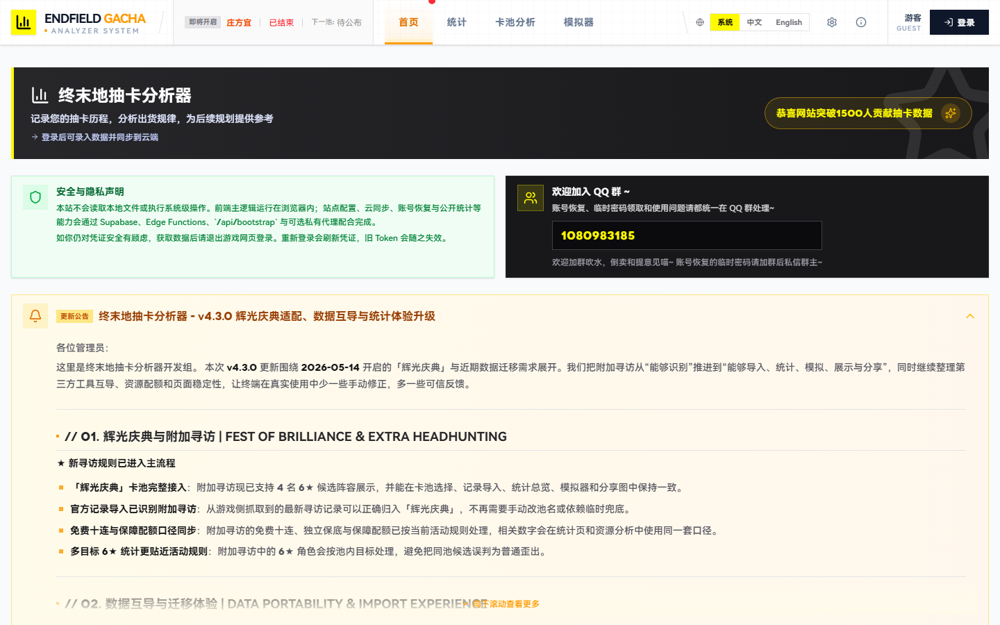
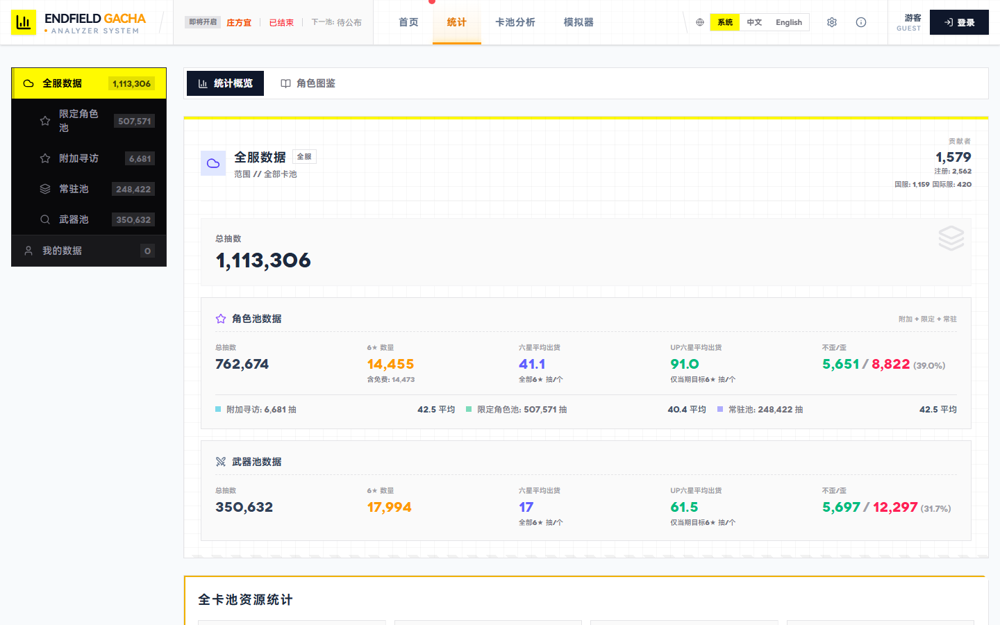
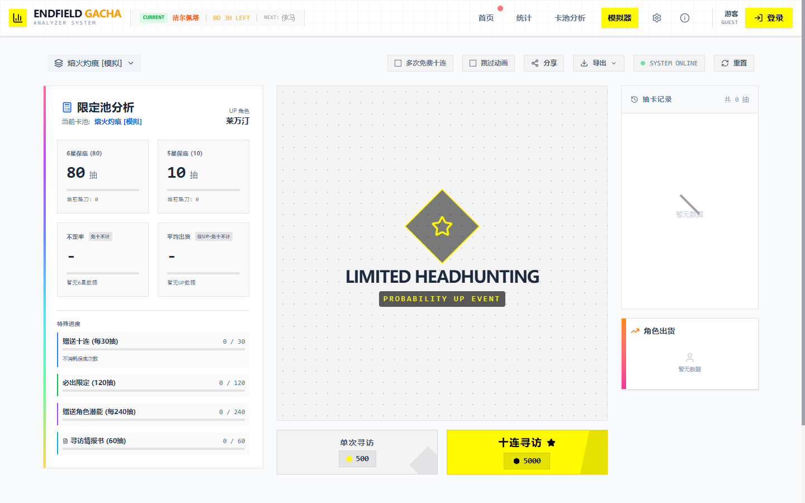
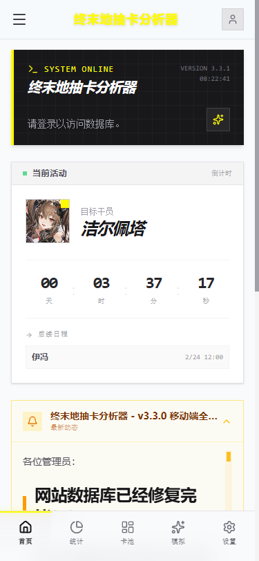

# Endfield Gacha Analyzer (终末地抽卡分析器)

A full-featured gacha pull tracker and analytics tool for *Arknights: Endfield*, with cloud sync, multi-user collaboration, and server-wide statistics.

一个功能完善的抽卡记录分析工具，专为《明日方舟：终末地》设计，支持云端同步、多用户协作和全服数据统计。

[](https://github.com/MoguJunn/endfield-gacha/releases)
[](LICENSE)


<p align="center">
  <a href="https://ef-gacha.mogujun.icu/">在线体验 / Live Demo</a>
</p>

## 预览 / Preview

| 桌面端首页 | 全服统计 |
|:---:|:---:|
|  |  |

| 抽卡模拟器 | 移动端 |
|:---:|:---:|
|  |  |

## 核心功能 / Features

- **多卡池支持** — 限定角色池（80 保底 / 120 硬保 / 240 赠送）、武器池（40 保底 / 80 硬保）、常驻池（80 保底 / 300 自选）
- **官方 API 导入** — 通过 Token 一键导入完整抽卡记录，智能去重、实时进度
- **数据可视化** — 全服 / 个人数据对比、稀有度饼图、6 星出货分布图、保底进度条
- **抽卡模拟器** — 真实还原游戏内概率模型（含软保底机制），支持无限十连
- **用户系统** — 邮箱认证、4 级权限体系（游客→用户→管理员→超管）、人机验证
- **云端同步** — 登录后数据自动同步，支持 JSON / CSV 导入导出
- **移动端适配** — 独立的移动端 UI，工业风格设计语言 + 暗色模式
- **工单系统** — 应用内反馈、Bug 报告与建议提交
- **管理后台** — 角色/武器数据同步、卡池管理、公告管理、用户管理、站点配置

## 技术栈 / Tech Stack

| 类别 | 技术 |
|------|------|
| 核心框架 | React 19 + Vite 7 |
| UI 样式 | Tailwind CSS v4 + Lucide React |
| 数据可视化 | Recharts 3 |
| 状态管理 | Zustand 5 |
| 后端服务 | Supabase (Auth + PostgreSQL + Realtime + Edge Functions) |
| 部署 | Vercel (前端 + Serverless) + Supabase |

## 快速开始 / Getting Started

### 在线使用

访问 **[ef-gacha.mogujun.icu](https://ef-gacha.mogujun.icu/)** 即可直接使用（无需安装）。

### 本地开发

```bash
git clone https://github.com/MoguJunn/endfield-gacha.git
cd gacha-analyzer
npm install
cp .env.example .env  # 编辑 .env 填入 Supabase 配置
npm run dev            # 启动前端（公开仓库默认可运行）
```

公开仓库默认包含前端、Serverless API、Supabase migrations 和 Edge Functions。

涉及游戏数据抓取的本地代理 / 独立后端因为合规与版权风险默认不纳入本仓库。如需导入链路，请在私有环境中接入单独维护的代理服务；否则公开仓库仍可用于基础浏览、统计、登录、云同步和管理功能开发。

## 环境变量

```env
VITE_SUPABASE_URL=你的Supabase项目URL
VITE_SUPABASE_ANON_KEY=你的Supabase匿名密钥
VITE_APP_URL=https://your-domain.vercel.app  # 用于邮件回调和实时功能
VITE_PROXY_URL=https://your-private-proxy.example.com  # 可选，仅私有导入代理使用
```

**SMTP 配置**：Supabase 免费版仅 2 封/小时，建议配置自定义 SMTP（推荐 Resend，3000 封/月免费）。

## 部署 / Deployment

### Vercel 部署

1. Fork 仓库 → 在 [Supabase](https://supabase.com) 创建项目
2. 先执行 `supabase/baseline/000_complete_schema.sql`，再执行 `supabase/migrations/` 中的标准前向迁移
3. 启用 `global_stats` 表的 Realtime
4. 配置 SMTP 服务
5. 在 [Vercel](https://vercel.com) 导入仓库，配置环境变量后部署

### 私有代理（可选）

涉及游戏数据抓取的代理/后端不属于当前公开仓库的审计与发布范围。若你确实需要导入链路，请在私有仓库或私有部署环境中单独维护，并通过 `VITE_PROXY_URL` 接入；公开仓库本身不再提供 `backend/` 目录或可直接运行的抓取服务实现。

### 数据库

需要的表：`profiles`、`pools`、`history`、`characters`、`announcements`、`blacklist`、`page_content`、`global_stats`、`rate_limits`、`tickets`、`ticket_replies`、`site_config`

数据库脚本现已分层：

- `supabase/baseline/`：新环境基线 schema
- `supabase/migrations/`：标准前向迁移链
- `supabase/manual/`：破坏性 / 高风险 / 回滚 / 数据回填脚本，仅手工执行
- `supabase/docs/`：迁移说明文档

新部署时先执行 `supabase/baseline/000_complete_schema.sql`，再按顺序执行 `supabase/migrations/`。超管功能需部署 Edge Functions（`admin-create-user`、`admin-delete-user`）：

```bash
supabase functions deploy admin-create-user
supabase functions deploy admin-delete-user
```

## 项目结构

```
gacha-analyzer/
├── api/                    # Vercel Serverless Functions
├── supabase/
│   ├── baseline/           # 新环境基线 schema
│   ├── migrations/         # 标准前向迁移链
│   ├── manual/             # 仅手工执行的危险 / 历史脚本
│   ├── docs/               # Supabase 迁移说明
│   └── functions/          # Supabase Edge Functions
├── scripts/                # 公开仓库内的开发辅助脚本
├── src/
│   ├── components/         # UI 组件
│   │   ├── admin/          # 管理面板 (panels/)
│   │   ├── common/         # 通用组件
│   │   ├── dashboard/      # 卡池分析
│   │   ├── home/           # 首页模块
│   │   └── layout/         # 布局 (Header, Footer, Sidebar)
│   ├── hooks/              # 自定义 Hooks (admin/ app/ summary/)
│   ├── services/           # 业务逻辑层 (admin/ cache/ sync/ stats)
│   ├── stores/             # Zustand 状态管理
│   ├── utils/              # 工具函数
│   ├── features/           # 功能模块 (simulator/ import/)
│   ├── mobile/             # 移动端 (components/ layouts/ views/)
│   └── constants/          # 常量配置
├── docs/                   # 补充文档（screenshots/、reviews/）
├── vite.config.js
├── vercel.json
└── .env.example
```

## 更新日志 / Changelog

### v3.5.0 (2026-03-12)
- 增加公共 bootstrap 只读代理，聚合站点配置、公共卡池、全服统计与角色排名
- 加载界面改为预热 + 限时等待 + 后台补齐，修复 trusted session 刷新卡死并补长加载提示
- 记录页导出增强，支持按时间 / 卡池 / 账号过滤，JSON / CSV 同步扩展元数据
- 国际服导入改为公开 token 入口 + 全后端代跑，支持国服 / 国际服分流与双后端部署
- 真实卡池详情补齐情报书来源标记，出货统计保留原柱状图
- 统一资源统计口径：武器池只统计总消耗，武库配额获得仅按角色池计算
- 修复模拟器跨池 120 抽硬保循环、继承后资源异常与武库配额负值归零

### v3.3.1 (2026-02-24)
- 修复移动端登出不完整（未清除 Supabase 会话）
- 统一桌面端/移动端主题持久化
- 新增移动端工单系统
- 移动端管理面板路由接入
- 站点配置可编辑化（数据库驱动）

### v3.3.0 (2026-02-05)
- 移动端 UI 全面重构（Endfield 工业设计语言）
- XSS 防护升级（rehype-sanitize）
- 全服统计精度校准（歪率判定重构）
- SummaryView 模块化拆分

### v3.2.0 (2026-02-05)
- 武器池数据导入修复（seqId 去重增加 pool_id 维度）
- 大文件拆分重构（PoolManagement 缩减 85%）
- CSS 动画收敛、代码库清理（删除 22 个未使用文件）

### v3.1.0 (2026-02-01)
- 请求队列管理器 + 指数退避重试
- 模拟器切换卡池状态修复
- 导入排队实时信息展示

### v3.0.0 (2026-02-01)
- 官方 API 数据导入功能
- 移除手动录入，统一使用 API 导入

### v2.8.0 (2025-12-29)
- "急"按钮全局点击统计（Realtime 同步）

### v2.5.0 - v2.7.3 (2025-12)
- 首页重构、页面内容管理、公告更新检测
- Markdown 编辑器升级、限定 6 星彩虹渐变主题
- 大量 UI 优化和 Bug 修复

### v2.0.0 - v2.4.x (2024-12 ~ 2025-12)
- 初始版本发布、架构重构、安全加固

## 安全特性

- Supabase Auth + 邮箱域名白名单
- RLS 行级安全策略
- API 频率限制 + 前后端参数验证
- DOMPurify + rehype-sanitize XSS 防护

## 制作团队

**蘑菇菌__** - 项目发起人 / 产品设计 & 项目管理 — [Bilibili](https://space.bilibili.com/14932613)

AI 开发助手：
- **Claude** (Anthropic) - 架构设计 & 全栈开发
- **Gemini** (Google) - UI 设计咨询

## 贡献

欢迎提交 Issue 或 Pull Request！

1. Fork 仓库 → 创建特性分支 → 提交更改 → 发起 PR

## 引用与鸣谢

本项目的开发离不开以下项目和服务：

**数据来源**
- [Warfarin Wiki](https://warfarin.wiki) — 角色 / 武器数据及静态资源图片

**基础设施**
- [Supabase](https://supabase.com) — 认证、数据库与实时功能
- [Vercel](https://vercel.com) — 前端部署与 Serverless Functions

**素材**
- [Transparent Textures](https://www.transparenttextures.com/) — 背景纹理
- [Lucide](https://lucide.dev/) — 图标库

**特别感谢**
- [上海鹰角网络科技有限公司](https://www.hypergryph.com/) — 感谢创造了《明日方舟：终末地》这款优秀的游戏

## 许可证

MIT License — 详见 [LICENSE](LICENSE)

## 联系方式

- 项目主页：https://github.com/MoguJunn/endfield-gacha
- 问题反馈：[GitHub Issues](https://github.com/MoguJunn/endfield-gacha/issues)

---

*本项目为粉丝自制工具，与游戏官方无关。游戏内容版权归 Gryphline / HyperGryph 所有。*
