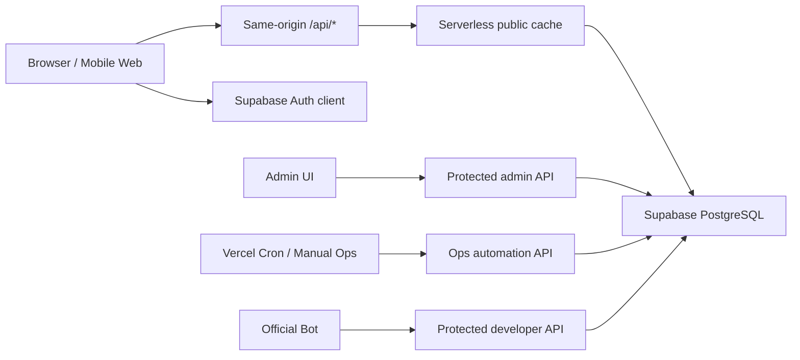

# Architecture

本文档描述当前 `v4.4.0` 主线架构。历史计划、旧 backend server 和退役部署方式不再作为主路径记录。

## 1. 系统边界



- 公共数据：生产浏览器统一请求同源 `/api/*`，由 Serverless 层访问 Supabase。
- 私有数据：用户抽卡历史、个人排行、工单、账号恢复和后台数据保持鉴权隔离与 `no-store`。
- 管理与自动化：后台写入、cron 和手动 ops 共享服务端 helper，写入成功后 best-effort 刷新公共缓存版本。
- 私有残留：`backend/` 只保留公开测试仍需要的兼容 helper，不代表完整私有后端。

## 2. 前端层

| 层级 | 主要文件 | 职责 |
|------|----------|------|
| 入口 | `src/main.jsx`、`src/AppRouter.jsx` | React 挂载、主题、双端路由、Speed Insights |
| 桌面端 | `src/App.jsx`、`src/GachaAnalyzer.jsx`、`src/components/app/DesktopAppRoutes.jsx` | 桌面壳层、初始化、主导航 |
| 移动端 | `src/mobile/MobileApp.jsx`、`src/mobile/layouts/MobileLayout.jsx` | 移动壳层、底栏、移动页面 |
| 状态 | `src/stores/*` | auth、pool、history、app 公共状态 |
| 公共读取 | `src/services/publicResourceClient.js` | 同源请求、公共版本、内存缓存、localStorage snapshot |
| 私有写入 | `src/services/cloudWriteService.js`、`src/utils/cloudDataSync.js` | 抽卡历史、池信息、账号数据同步 |

当前仍需后续治理的前端复杂点：

- `SIM-004`：模拟器控制器仍承担过多 UI、资源、继承和分享状态。
- `ARCH-021`：桌面 / 移动端 dashboard、settings 仍有重复控制器逻辑。

## 3. API 层

| 路径 | 入口 | 说明 |
|------|------|------|
| `/api/*` | `api/router.js` + `api/_routes/index.js` | Vercel 单入口，规避函数数量膨胀 |
| 公共 API | `api/_routes/root/bootstrap.js`、`announcements.js`、`stats.js`、`pool-rosters.js` | 公共数据读取和缓存 meta |
| 后台 API | `api/_routes/root/admin.js` | 管理面板统一入口 |
| 自动化 API | `api/_routes/root/ops-automation.js`、`api/_lib/runOpsAutomation.js` | cron、manual、job graph、review bundle |
| BOT / 开发者 API | `api/_routes/dev/**/*`、`api/_routes/integrations/**/*` | 受保护只读接口和平台绑定 |

公共 API 的兼容响应字段保留 `success / data / cached / partial`，新增 `meta.source / meta.age / meta.partial / meta.stale / meta.cacheKey / meta.cacheVersion` 用于诊断。

## 4. 公共缓存与刷新

- 服务端缓存 helper：`api/_lib/publicCache.js`。
- 全局版本源：`site_config.public_cache_epoch`。
- 版本读取：`/api/public-cache-version`，响应 `no-store`。
- 显式刷新：`/api/admin-public-cache-bump` 和写入侧 best-effort bump。
- 前端降级：公共读取失败时使用最近一次 localStorage snapshot；生产环境不默认回退到 Supabase 浏览器直连。

公共缓存只覆盖首屏、公告、全服统计、卡池目录、阵容和公开 catalog。用户私有数据、后台数据、个人排行和恢复工单不得进入该缓存层。

## 5. 数据库层

Supabase 目录采用“baseline + 归档迁移 + 手工脚本”结构：

- `supabase/baseline/000_complete_schema.sql`：新环境唯一默认入口。
- `supabase/archive/migrations/`：已合并进 baseline 的标准迁移，仅用于审计和重建 baseline。
- `supabase/migrations/`：未来新增且尚未合并的前向迁移。
- `supabase/manual/`：危险、回滚、回填和历史诊断脚本，不进默认部署链。

DB-OPTIMIZE-001 的当前结论：线上 `history` 体积主要来自索引，字段或索引删除需要先完成查询计划、读写路径、回滚脚本和线上基准。本轮只整理迁移归档与 baseline，不直接改变生产 schema 语义。

## 6. 运营自动化

`OPS-006` 当前 graph：


每个节点记录依赖、输入源、输出摘要、耗时、attempts、failureType、warnings、cacheInvalidation、requiresReview 和 published。数据库仍复用 `ops_automation_runs`，`status` 只使用 `success / failure / skipped`；“部分成功”由 `summary.ops.presentationStatus = "partial"` 派生。

## 7. 可观测性与体积预算

- 前端观测：`@vercel/analytics`、`@vercel/speed-insights`。
- 构建预算：`npm run perf:report`。
- 公共网络边界：`npm run test:public-api-boundary`。
- 资源治理：大图优先压缩为 Web 友好格式，截图只保留 README 所需视图；字体 source 与 generated subset 分层维护。
- 已知热点：Serverless 分享图依赖 Chromium，Vercel output 体积仍需长期观察。

## 8. 验证入口

```bash
npm test
npm run test:unit
npm run lint
npm run build
npm run perf:report
npm run test:supabase-baseline
npm run test:public-api-boundary
```
